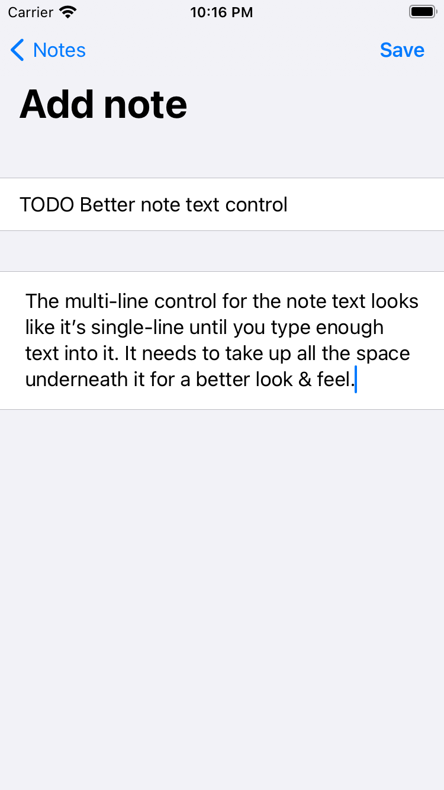

#  Your most basic note taking app

### What can it do?
Well, you're probably not going to be impressed. And that's fine :)
I just wanted to experiment a bit and get a feel for writing Swift code. 

- It allows you to create a note, after inputting a title and text.
  - There's validation for a note's Title; the Save button is going to be disabled if you leave it empty. A note without a title would make little sense, at least in the way I've imagined the app, so I'm making an executive decision here.
- All notes you've saved are persisted.
  - You can close the app, phone, simulator and come back to it after 6 months, when you've been reminded you have neglected your Github repos, and they're still going to be there (tested it myself).
- Editing notes has been a must.
  - Just tap on a note and it's going to send you to the edit screen. There's no separate View action right now, so when you View it, you can also Edit it.
- Deleting notes also works.
  - One of the first things I needed actually. The list gets cluttered easily when testing and debugging.
Oh and of course, you can scroll if the list is long enough.
- Also (partially) works on MacOS
  - Creating, editing and data persistence only. Deleting doesn't work, I haven't found an approach I like (that I could make work)

### Screenshots
 

